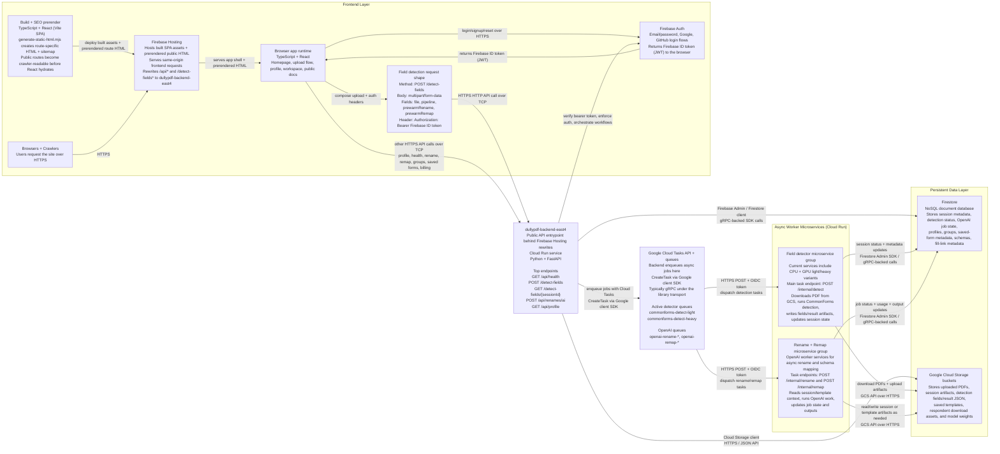

# Cloud Architecture

This is the current production-oriented service map for DullyPDF. It shows how
the React frontend, Firebase Hosting/Auth, the public FastAPI backend, Cloud
Tasks, detector/OpenAI worker services, Firestore, and Cloud Storage fit
together.

The naming here matches the live production deployment verified on March 20,
2026. Exact Cloud Run service names and routing modes can change over time, so
keep this doc aligned with deploy config and GCP service settings when infra
changes land.

## Mermaid Diagram

## Key Notes

- `dullypdf-backend-east4` is the current public backend entrypoint because
  Firebase Hosting rewrites send `/api/*` and `/detect-fields*` traffic there.
  It is fine to call it the "API gateway" informally, but it is not the separate
  Google API Gateway product. It is a Cloud Run FastAPI service acting as the
  public API entrypoint.
- Cloud Tasks is not a worker and it does not "create" detector instances. The
  detector and OpenAI services already exist as deployed Cloud Run services.
  Cloud Tasks stores a job, then later sends an authenticated HTTPS request to
  the correct worker endpoint.
- There are two different communication hops around Cloud Tasks:
  - Backend -> Cloud Tasks API: `CreateTask` through the Google client library,
    typically using gRPC under the hood.
  - Cloud Tasks -> worker service: HTTPS `POST` with an OIDC token to
    `/internal/detect`, `/internal/rename`, or `/internal/remap`.
- Firestore is a NoSQL document database. In this architecture it mainly holds
  metadata and status: session docs, OpenAI job docs, user/profile metadata,
  saved-form metadata, schema metadata, and related workflow state.
- GCS holds the larger binary/object artifacts: uploaded PDFs, session output
  JSON, saved templates, respondent download artifacts, and model weights.

## Current Production Snapshot

- Public backend entrypoint: `dullypdf-backend-east4` in `us-east4`
- Additional direct backend deployment: `dullypdf-backend` in `us-central1`
- Detector services:
  - `dullypdf-detector-light`
  - `dullypdf-detector-heavy`
  - `dullypdf-detector-light-gpu`
  - `dullypdf-detector-heavy-gpu`
- Session cleanup batch job: `dullypdf-session-cleanup`
- Current prod backend routing is configured for GPU-backed detector URLs, while
  Cloud Tasks detector queues still live in `us-central1`

## Related Docs

- [frontend/docs/overview.md](/home/dully/projects/dullyPDF/frontend/docs/overview.md)
- [frontend/docs/api-routing.md](/home/dully/projects/dullyPDF/frontend/docs/api-routing.md)
- [backend/README.md](/home/dully/projects/dullyPDF/backend/README.md)
- [backend/fieldDetecting/docs/detectingPipeline.md](/home/dully/projects/dullyPDF/backend/fieldDetecting/docs/detectingPipeline.md)
- [backend/fieldDetecting/docs/rename-flow.md](/home/dully/projects/dullyPDF/backend/fieldDetecting/docs/rename-flow.md)
